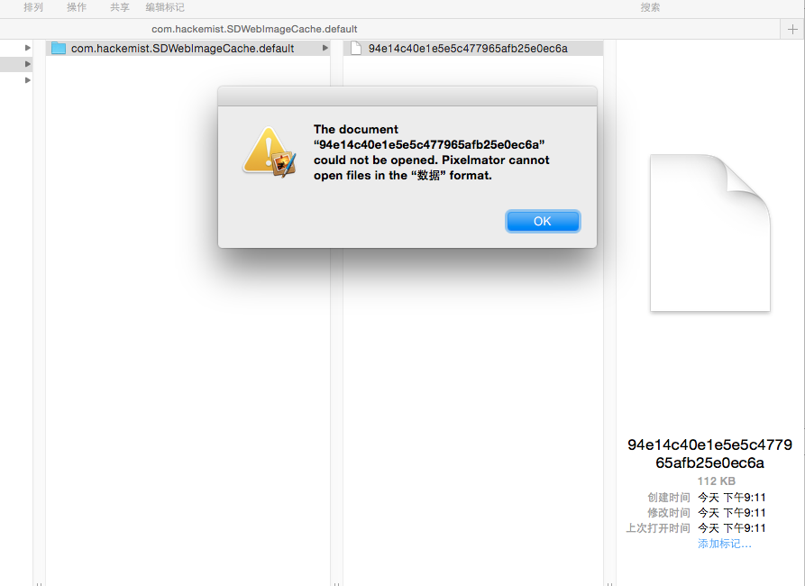

# SDWebImage_Security
SDWebImage 保存图片的加密操作(AES)





##使用
1.如果不想加密  
```
//调用相关方法,和 SDWebImage 使用方式相同
- (void)sd_setImageWithURL:(NSURL *)url;
```

2.如果需要加密  
```
//对应的方法名前面加上 AES 前缀即可
- (void)sd_AESSetImageWithURL:(NSURL *)url;
```
